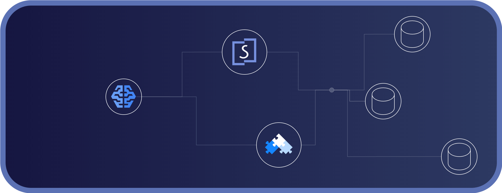

# Solanica Agent Skills

Agent Skills to help developers using AI agents with Solanica platform and
OpenEverest. Agent Skills are folders of instructions and references that
agents like Claude Code, Cursor, and OpenClaw can discover and use to do
things more accurately and efficiently.

The skills in this repo follow the [Agent Skills](https://agentskills.io/)
format.

## Installation

```bash
npx skills add solanicaio/agent-skills
```

### Claude Code Plugin

You can also install the skills in this repo as Claude Code plugins.

```bash
/plugin marketplace add solanicaio/agent-skills
/plugin install openeverest-api@solanicaio-agent-skills
```

## Available Skills

<details>
<summary><strong>openeverest-api</strong></summary>

OpenEverest API reference skill for authentication and platform operations.
Includes on-demand documentation for resources, operations, and schemas.

**Use when:**

- Working with OpenEverest API endpoints and authentication
- Managing database clusters, backups, restores, and monitoring
- Updating infrastructure policies (scheduling, load balancing, DNS)
- Looking up API operation payloads, responses, and schema definitions

**Coverage:**

- 14 resource index documents
- 59 operation reference documents
- 27 schema groups (61 schema documents)

</details>

## Usage

Skills are automatically available once installed. The agent will use them when
relevant tasks are detected.

**Examples:**

```
Create a new PostgreSQL cluster with 2 replicas
```

```
How many databases do I have managed by OpenEverest?
```

```
Were there any backups made recently?
```

## Skill Structure

Each skill follows the [Agent Skills Open Standard](https://agentskills.io/):

- `SKILL.md` - Required skill manifest with frontmatter and usage instructions
- `references/` - Operation, resource, authentication, and schema documentation
